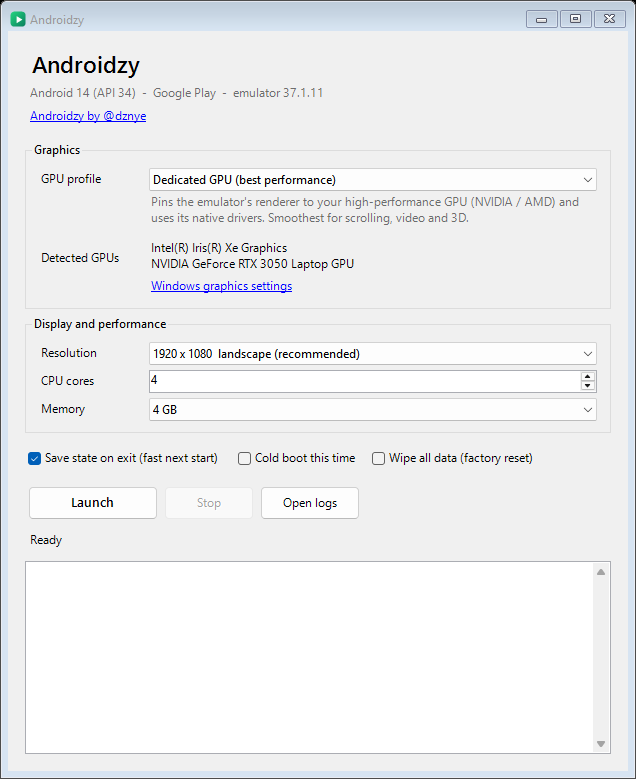

# Android emulator for apps: a BlueStacks, MEmu & LDPlayer alternative (Androidzy)

**Androidzy by [@dznye](https://github.com/dznye)** - a free, open-source Android emulator for Windows PC, built for running **apps** (not games). A simpler alternative to BlueStacks, LDPlayer, MEmu and MuMu Player if all you want is Android apps on your desktop: a second Android device with real Google Play, the official Google emulator and one-click GPU profiles.

Website: **https://dznye.github.io/Androidzy/**



## Why

Most Android emulators are marketed for games. Androidzy is for everything else you do on a phone, on the computer you already sit at all day:

- a **second phone for work** - Slack, Teams, Gmail, Telegram, kept apart from your personal phone
- **accounts you own or manage** - sign in to as many accounts as each app allows
- **mobile-only apps on a big screen**, with keyboard, mouse, screenshots and recording
- **testing apps** on real Android 14 with adb, without installing Android Studio

Windows Subsystem for Android ended on March 5, 2025, so there is no built-in way to run Android apps on Windows 11 any more. Androidzy fills that gap.

It also fixes a real annoyance: on laptops with two GPUs (Intel + NVIDIA/AMD) the emulator can render on the wrong one, or even run OpenGL on one GPU and Vulkan on the other. Androidzy pins both to the GPU you choose, sets up a sensible virtual device, and gets out of the way.

**Responsible use:** for accounts you own or are authorised to manage. Androidzy does not hide that it is an emulator, and some apps (many banking and DRM-protected streaming apps) block emulators. It currently runs one Android device at a time.

## Features

- **Starts clean** - on a new device the preinstalled apps are removed automatically (Play Store, Files, Settings and the Google search app stay). Reversible from Google Play; switch it off with *Remove preinstalled apps*.
- **Share folder** - `Desktop\Androidzy Share` is created automatically. Anything dropped in it while the emulator runs is copied to the phone (photos to Pictures, videos to Movies, music to Music, the rest to Download, under `Androidzy/`) and registered with Android's media library. Put it anywhere with *Share folder ▾ > Move share folder...* (pick an existing folder or make a new one); *Use the Desktop folder again* switches back.
- **US location on every boot** - GPS is set to New York each time Android starts, in device-only mode so Google's network location is not used.
- **Pixel Fold by default** - the emulator gets a hinge with closed / half-open / open postures, so its fold controls appear (Extended controls > Virtual sensors > Device pose). *Google Pixel Fold 720p* (1104 x 920) keeps the same layout and fold controls with a quarter of the pixels to draw, which makes video apps much lighter.
- **Privacy settings** - background Wi-Fi/Bluetooth scanning and error reporting are switched off. This limits what the device volunteers; it does not make it anonymous.

- **Profiles** - Dedicated, TikTok, Everyday apps, Integrated, Windows default, or Software. OpenGL *and* Vulkan follow the same GPU; the status line shows which one is in use.
- **Fast restarts** - quick-boot snapshots bring Android back in about a second.
- **Zero setup** - uses the Android SDK you already have from Android Studio, or downloads what it needs from Google on first run.
- **One small exe** - a single native Windows program (about 75 KB) built with the C# compiler that ships with Windows. No installer, no runtime to install.
- Resolution presets, CPU/memory settings, cold boot, factory reset, per-launch logs.

## Requirements

- Windows 10/11 x64
- Hardware virtualization enabled in the BIOS and the Windows feature **Windows Hypervisor Platform**
- About 6 GB of free disk space (more if you keep a quick-boot snapshot)

## Getting started

1. **[Download Androidzy.exe](https://github.com/dznye/Androidzy/releases/latest/download/Androidzy.exe)** (one 75 KB file; [release notes and SHA-256](https://github.com/dznye/Androidzy/releases/latest)), or build it yourself (below). Windows SmartScreen may warn because the exe is not code-signed yet.
2. Run `Androidzy.exe`.
   - If an Android SDK with the Android 14 *Google Play* system image is found (Android Studio's default location, `ANDROID_HOME` or `ANDROID_SDK_ROOT`), it is used as is.
   - Otherwise a **First-run setup** panel offers to download the emulator, platform tools and system image (about 2 GB) from Google, after you accept Google's license.
3. Pick a GPU profile and press **Launch**.

Settings, the virtual device and any downloaded components live in `%LOCALAPPDATA%\Androidzy`. Put a `sdk` folder next to `Androidzy.exe` and it runs as a portable install instead.

## GPU profiles

| Profile | What it does |
|---|---|
| **Dedicated GPU** | Tells Windows to run the emulator on the high-performance GPU and pins Vulkan to the same one. Default on machines with an NVIDIA/AMD card. |
| **TikTok (smooth video)** | Dedicated GPU, display locked at 60 fps. Turns off the emulator's `c2.goldfish.*` host video decoders (`-feature -HardwareDecoder`), which stall when TikTok swaps players between videos, and the netsim Wi-Fi relay (`-feature -WiFiPacketStream`), which added ~85 ms to every round trip. Adaptive power (below). Selecting it fills in *Pixel Fold 720p*, 4 cores and 8 GB. Measurements: [RESEARCH-TIKTOK.md](RESEARCH-TIKTOK.md). |
| **Everyday apps (quiet)** | For chat, email and browsing: power-saving GPU, display locked at 30 fps, direct Wi-Fi, adaptive power. Selecting it fills in *Pixel Fold 720p*, 4 cores and 4 GB. Not for video feeds or games. |
| **Integrated GPU** | Same, for the power-saving GPU. Cooler and quieter, slower. |
| **Windows default** | Removes the override; Windows and the emulator choose. |
| **Software renderer** | SwiftShader/ANGLE on the CPU. Slow; only for broken GPU drivers. |

Profiles only *suggest* a screen, cores and memory: the boxes can be changed after picking one, and Launch uses whatever they show. Profiles that change boot-time features (TikTok, Everyday) cold-boot once when you switch to or from them.

**Adaptive power** (TikTok and Everyday): Androidzy reads Android's own CPU use every 1.5 s. While Android is busy the emulator runs at above-normal priority with Windows power throttling off and normal memory priority. After 20 s idle it drops to below-normal priority, Windows efficiency mode and low memory priority, so if the PC runs short of RAM, Windows takes it from the idle emulator before your other apps. The phone's RAM itself is fixed while it runs: the emulator's QEMU has no free-page reporting, so pick a memory size that leaves Windows room (the log shows how much is left).

The override is the same per-app setting as *Settings > System > Display > Graphics*, written under `HKCU\Software\Microsoft\DirectX\UserGpuPreferences` for the emulator executables only. Choose **Windows default** to remove it.

## Settings file

`%LOCALAPPDATA%\Androidzy\Androidzy.ini` holds what the window remembers, plus three optional keys that have no control in the window:

| Key | Effect |
|---|---|
| `timezone=America/New_York` | Phone time zone (IANA id), set on every boot and passed as `-timezone`. Empty = the PC's zone. |
| `private_dns=one.one.one.one` | Turns on Android's Private DNS (DNS over TLS) with this host, so lookups are encrypted. It does not change your IP. |
| `http_proxy=host:port` | Passed to the emulator as `-http-proxy`. Only TCP goes through it; UDP (QUIC) does not, so a VPN on the PC is the way to change the IP everything uses. |

A `src\Local.cs` (ignored by git) can implement `Settings.LocalDefaults()` to bake personal defaults into your own build; values in the ini still win.

## Command line

```
Androidzy.exe [--launch] [--profile dedicated|tiktok|everyday|integrated|auto|software]
              [--res N] [--cold] [--no-save] [--headless] [--verbose]
              [--accept-license] [--own-copy]
```

`--accept-license` starts the first-run download without clicking (you are accepting Google's license by using it). `--own-copy` ignores an existing SDK and downloads a private copy.

## How it works

Androidzy never modifies or bundles the emulator. It writes the AVD config, sets the Windows GPU preference for the emulator's executables, and starts `emulator.exe` with:

- `-gpu host` (or `swangle` for the software profile),
- `ANDROID_EMU_VK_SELECT_GPU=0` - the Windows preference orders the host GPUs, so index 0 is the pinned GPU. Without it the emulator scores GPUs on its own and can pick a different one for Vulkan than for OpenGL,
- `ANDROID_EMULATOR_WAIT_TIME_BEFORE_KILL=60` so saving a snapshot is not cut short,
- `-no-metrics`, `-accel on`, and the usual boot and network flags.

## Building

Needs only Windows (the C# compiler is part of the .NET Framework that ships with it):

```powershell
powershell -ExecutionPolicy Bypass -File build.ps1
```

The result is `bin\Androidzy.exe`.

## Legal

- Androidzy's own code is released under the [MIT License](LICENSE).
- **No Google software is included in this repository or in Androidzy's releases.** The Android Emulator, platform tools and system image are downloaded from Google's servers (or taken from your existing SDK) and are licensed to you by Google under the [Android Software Development Kit License Agreement](https://developer.android.com/studio/terms). Please read it; it is between you and Google.
- Androidzy is an independent project. It is not affiliated with, sponsored by or endorsed by Google. Android, Google Play and the Android robot are trademarks of Google LLC.
